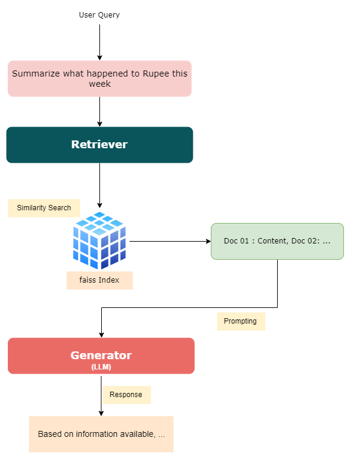
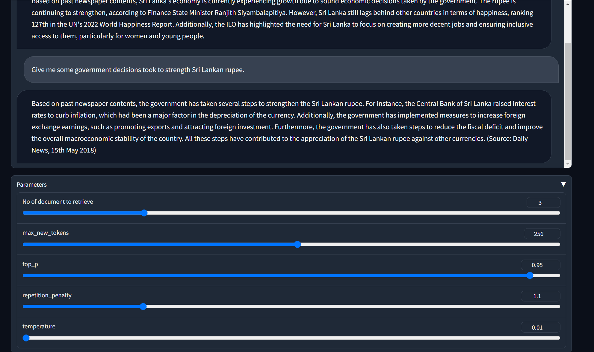

# daily-llama 🦙

### Retrieval augmented generation framework based on news contents.

This project presents a retrieval-augmented generation framework tailored for news content. By employing the FAISS index for efficient similarity search, relevant documents are retrieved. Leveraging the LLAMA-2 model, these retrieved documents serve as a foundation for generating comprehensive and contextually accurate answers.



### Demo

https://github.com/Ransaka/daily-llama/assets/48125060/703feeaf-9a54-4831-9718-ed448e26be0d

### Usage info
```bash
python3 daily-llama.py --dataset_path data/news-small.json --load_in_4bit True --query "What happened with Dimuth's cricket career?"
```
Sample Response
```md
Based on past newspaper contents, it appears that Dimuth Karunaratne's cricket career has been impacted by recent legal issues. According to a news article from March 2023, he was charged with driving under the influence of liquor and was released on bail after being produced before the Colombo Fort Magistrate Court. Additionally, he has requested the national cricket selection committee to reconsider his request to step down as Sri Lanka's Test captain due to personal reasons. However, it is unclear at this time how these legal issues will affect his playing career moving forward.

```
### Gradio App Example
```bash
git clone https://github.com/Ransaka/daily-llama.git
cd /content/daily-llama
pip install -r requirements.txt --q
python server.py --dataset_path data/news-small.json --load_in_4bit True # you may require `huggingface-cli login` prior to this step
```

